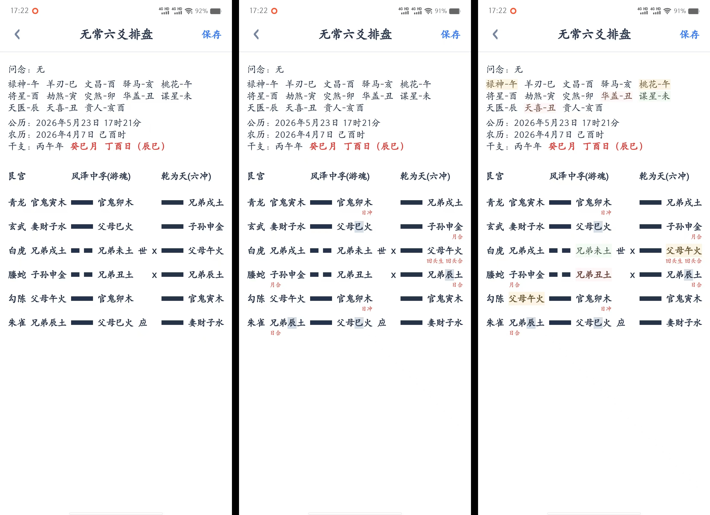
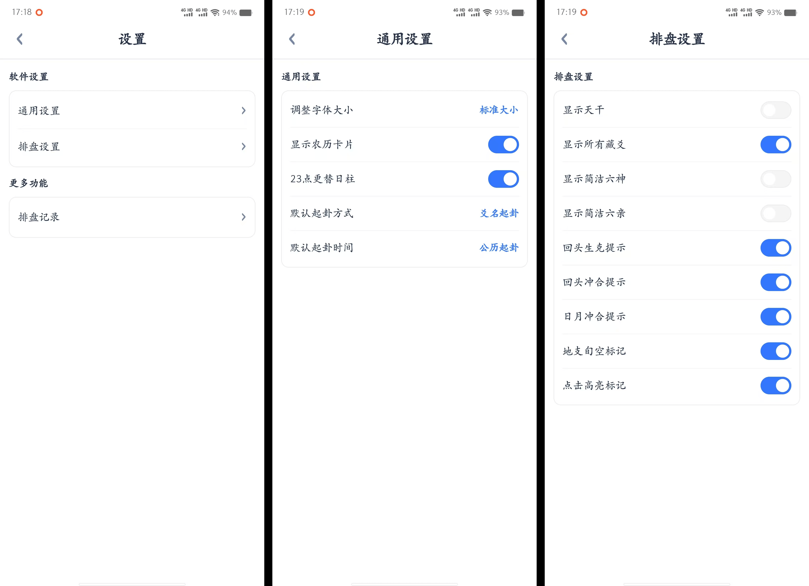
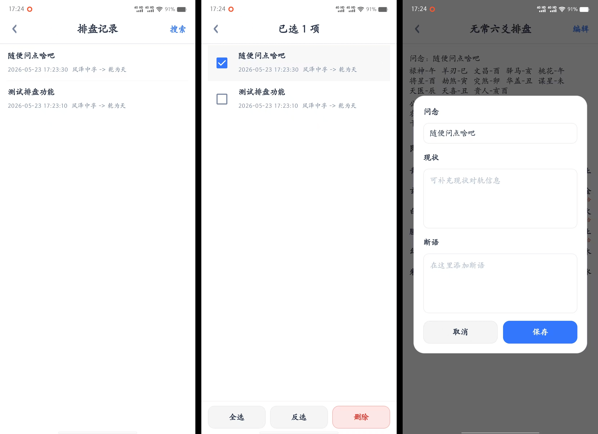

# 无常六爻排盘

一个基于 Jetpack Compose 开发的 Android 六爻排盘应用，项目代码全称使用 AI 进行开发，纯白背景简洁干净，“无常六爻排盘”软件名称源自我的好友，感谢他指导我学习六爻

## 支持多种起卦方式

- 爻名起卦：手动指定阴爻阳爻状态
- 点选起卦：通过点击切换阴爻阳爻状态
- 铜钱起卦：手动指定硬币的正反面
- 在线摇卦：电脑模拟铜钱摇卦，根据随机正反面指定阴爻阳爻状态
- 自动起卦：该方式可一键起卦，无需摇卦

## 支持多种起卦时间

- 公历起卦：正常选择公历进行起卦
- 农历起卦：使用农历进行起卦，支持闰月计算
- 干支起卦：手动选择天干地支进行起卦

时间换算基于 `cn.6tail:lunar 1.7.7`，用于公历、农历、干支、节气相关信息计算，当前时间选择范围按现代公开日历资料处理：

- 公历：`1901..2100`
- 农历：`1900..2100`，并按公历边界过滤可选日期
- 干支：通过下方的选择器快速指定干支，最低只需要月支和日辰干支即可起卦

## 排盘功能展示

- 根据起卦时间推算天干地支与旬空，与农历正月初一更替不同，数术中的干支是基于立春进行更替
- 推算本卦、变卦、卦宫、世应、爻的六亲天干地支五行以及变卦的内容
- 推算常用 13 个星煞（禄神、羊刃、文昌、驿马、桃花....）
- 推算六神（青龙、白虎、朱雀、玄武、勾陈、腾蛇）
- 卦中支持显示更多细节（全部藏爻、旬空、日月冲合、回头作用以及选中高亮等功能）

额外介绍下高亮，该功能参考自 **华鹤易学APP** 看神煞时非常方便，同时感谢朱辰彬老师撰写《古筮真诠》这一著作

如果您在设置页中点击`排卦设置`，开启`点击高亮标记`功能后：

1. 点击选中某个爻，被选中的爻会有淡绿色背景色，卦中会高亮与该爻有关系的其他爻
2. 同属性的爻同样会用淡绿色标识，被选中的爻字体会变细，与其他同属性的爻进行区分
3. 与选中爻地支相合的爻会用橙色标识
4. 与选中爻地支相冲的爻会用红色标识

## 设置项展示

软件设置中分为 **通用设置** 和 **排盘设置** 两个板块：

通用设置：代表软件整体通用性的设置，其中包含

- 调整字体大小：软件对不通分辨率做了一些适配，但仍然无法在所有尺寸的屏幕上完美显示，所以加了调整字体大小的功能
- 显示农历卡片：对应首页装卦时顶部的农历日期信息
- 23点更替日柱：开启后如果是 23 点后起卦，排盘时使用另一天的子时作为起卦时间
- ....

排盘设置：可以优化排盘界面的细节展示，例如旬空回头生克冲合等等，一看就明白，就不挨个解释了

## 更多功能

### 本地历史记录

排卦后右上角有保存按钮，点击后进入设置页点击`排盘记录`会看到保存过的所有卦例

1. 在列表页中可以根据关键字查找指定卦例
2. 长按列表页可以进行批量删除
3. 点击进入排盘页，可以在右上角对改卦例进行完善

### 更多功能

更多功能未来会继续开发
